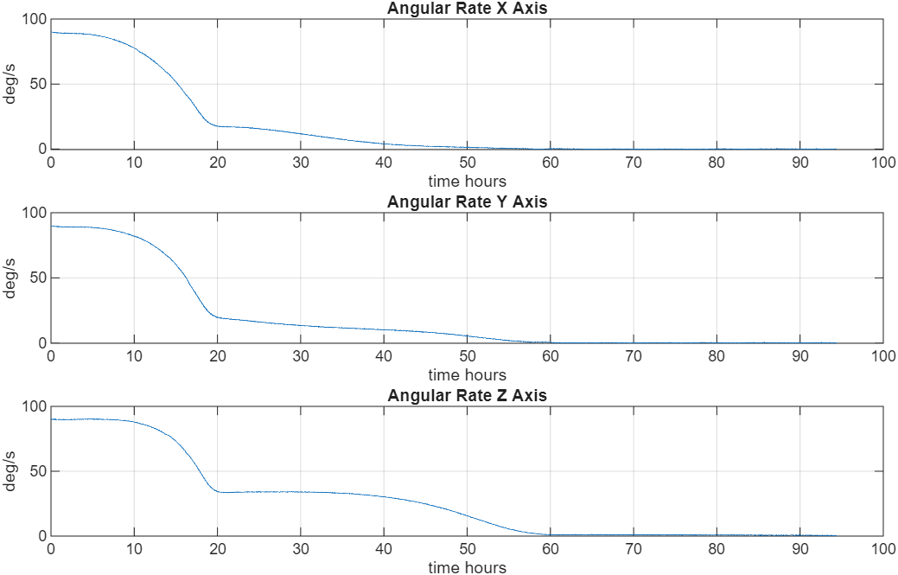

```plaintext
████╗         
██╔═██╗ ████╗  ██████╗ █████╗ ████████╗     ██╗     ███████╗██╗  ██╗████████╗██████╗  ██████╗ ███╗   ██╗
████╔╝ ██╔═██╗██╔════╝██╔══██╗╚══██╔══╝     ██║     ██╔════╝██║ ██╔╝╚══██╔══╝██╔══██╗██╔═══██╗████╗  ██║
██╔══╝ ╚████╔╝██║     ███████║   ██║        ██║     █████╗  █████╔╝    ██║   ██████╔╝██║   ██║██╔██╗ ██║
╚═╝     ╚═══╝ ██║     ██╔══██║   ██║        ██║     ██╔══╝  ██╔═██╗    ██║   ██╔══██╗██║   ██║██║╚██╗██║
              ╚██████╗██║  ██║   ██║        ███████╗███████╗██║  ██╗   ██║   ██║  ██║╚██████╔╝██║ ╚████║
               ╚═════╝╚═╝  ╚═╝   ╚═╝        ╚══════╝╚══════╝╚═╝  ╚═╝   ╚═╝   ╚═╝  ╚═╝ ╚═════╝ ╚═╝  ╚═══╝
       ╔═╗╦═╗╔═╗╔═╗  ╔╦╦╗╔═╗╔╦╗╦  ╔═╗╦═╗  ╔═╗╦╔╦╦╗╦ ╦╦  ╔═╗╔╦╗╦╔═╗╔╗╔╔═╗
══════ ╠═╣║ ║║  ╚═╗  ║║║║╠═╣ ║ ║  ╠═╣╠═║  ╚═╗║║║║║║ ║║  ╠═╣ ║ ║║ ║║║║╚═╗ ══════════════════════════════════
       ╩ ╩╩═╝╚═╝╚═╝  ╩╝╚╩╩ ╩ ╩ ╚═╝╩ ╩╩═╝  ╚═╝╩╩╝╚╩╚═╝╚═╝╩ ╩ ╩ ╩╚═╝╝╚╝╚═╝
```

## **Status:** Development

This repository contains the MATLAB simulations for the ADCS of the **PoCat-Lektron PocketQube (PQ)**, a 0.5U spacecraft developed at the NanoSat Lab. It covers two sequential control modes driven by three orthogonal magnetorquers: **Detumbling** (B-Dot rate damping after deployment) and **Nadir Pointing** (closed-loop attitude control with a Multiplicative Kalman Filter). Each mode is a self-contained MATLAB pipeline with its own configuration scripts, sensor models, and vendored copy of the Princeton Satellite Systems CubeSat Toolbox.

- [Project Files' Structure](#project-files-structure)
- [Detumbling](#detumbling)
- [Nadir Pointing](#nadir-pointing)
- [License](#license)

> [!NOTE]
> See the [NanoSat Lab Wiki](https://wiki.nanosatlab.space) for more PoCat-Lektron PQ information.

## **Project Files' Structure**

The two pipelines live side by side and are fully independent — each has its own top-level script, configuration folder, and `utils/` tree. To run either one, `cd` into its directory and call the top-level script; `PSSSetPaths(1)` adds all required subdirectories to the MATLAB path automatically.

```plaintext
PoCat-Lektron-ADCS/
├── Detumbling/
│   ├── SimConfiguration/               # orbit, sensors, PID, data-structure scripts
│   ├── SimMagnetorquers/               # sensor noise models and coil calculations
│   ├── SimHysteresisRods/              # optional passive damper variant
│   ├── utils/
│   │   ├── CubeSatToolbox/             # vendored PSS toolbox (Detumbling copy)
│   │   └── results/                    # timestamped MultiSim outputs (gitignored)
│   ├── Detumbling.m                    # single-run entry point
│   └── MultiSim.m                      # batch runner
├── NadirPointing/
│   ├── SimConfiguration/               # orbit, sensors, PID, MKF, data-structure scripts
│   ├── utils/
│   │   ├── CubeSatToolbox/             # vendored PSS toolbox (NadirPointing copy)
│   │   ├── Sensors/                    # gyro and magnetometer noise injection
│   │   ├── MKF_functions/              # Kalman filter helpers (incl. custom quat2rotm)
│   │   ├── Functions/                  # CubeSatFaces, PID3Axis2, TRIAD, rotmatrix2quat
│   │   ├── sun estimator sun sensors/  # photodiode → sun-vector estimators
│   │   └── debug/                      # sim_debug.mat workspace dump (gitignored)
│   └── NadirPointing.m                 # single-run entry point
├── Bibliography/
├── LICENSE.md
└── README.md
```

## **Detumbling**

### Overview

Detumbling is the first active ADCS mode, executed immediately after separation from the launch vehicle. At deployment the spacecraft typically has a large, uncontrolled angular rate (tumbling). The objective is to reduce that rate to near zero before any pointing mode can begin. The PoCat-Lektron PQ achieves this using three orthogonal magnetorquers driven by the **modified B-Dot** control law.

### Algorithm

The commanded magnetic dipole moment **m** at each control step is:

```
m = k · (ω × B)
```

where **ω** is the body angular rate (gyroscope), **B** is the local geomagnetic field (magnetometer), and *k* is a scalar gain pre-computed from the actuator saturation limits and the nominal spin rate. This torque is dissipative and unconditionally stable: it always reduces the angular momentum component perpendicular to **B**. Because the field direction rotates relative to the body over successive orbits, full three-axis detumbling is achieved within a few orbital periods.

The gain is set so that the actuator saturates at the initial angular rate, maximizing the applied torque from the very first step.

### Simulation Characteristics

| Parameter | Value |
|---|---|
| Spacecraft bus | 0.5U PocketQube (5 × 5 × 5 cm, 234 g) |
| Orbit | 500 km circular, 90° inclination |
| Initial angular rate | [90, 90, 90] °/s (worst-case post-deployment) |
| Simulation duration | 1 orbit |
| Integration method | 4th-order Runge-Kutta, 0.25 s step |
| Control update rate | 1 Hz |
| Magnetorquers | 3-axis PCB coils; saturation limits from coil geometry |
| Gyroscope | Bias + angle/rate random-walk noise (IEEE 952-2004) |
| Magnetometer | Calibration-matrix error + Gaussian bias + sample noise |
| Disturbances | Aerodynamic drag, radiation pressure, gravity gradient, magnetic |
| Optional | Passive hysteresis-rod damper (disabled by default, `d.HR = 0`) |

### Key Files

| File | Role |
|---|---|
| `Detumbling.m` | Main script — simulation loop, B-Dot law, plotting |
| `MultiSim.m` | Batch runner — repeats `Detumbling` and saves angular rate results |
| `SimConfiguration/Sim_sat_initial_state.m` | Orbit, initial quaternion and angular rate |
| `SimConfiguration/Sim_time_parameters.m` | Integration step and simulation duration |
| `SimConfiguration/Sim_data_structure.m` | Spacecraft, power, surface model, magnetorquer geometry |
| `SimConfiguration/Sim_hysteresis_damper.m` | Optional passive hysteresis-rod damper |
| `SimConfiguration/Sim_thermal_control_config_file.m` | Face optical properties for thermal model |
| `SimMagnetorquers/Sensors_Config_File.m` | Sensor noise and calibration models |
| `SimMagnetorquers/Gyro_measurement.m` | Gyro noise injection and moving-average queue |
| `SimMagnetorquers/Magnetometer_measurement.m` | Magnetometer noise and calibration injection |
| `SimMagnetorquers/Calculations.m` | Standalone coil-area design script (not called by simulation) |

### Results

<div align="center">



<p><b>Figure 1:</b> <i>Angular rate during detumbling (three body axes, deg/s vs time)</i>

</div>

## **Nadir Pointing**

### Overview

Nadir Pointing is the second active ADCS mode, executed once the spacecraft has been detumbled. The objective is to align a fixed body axis (the +Z body axis) with the local nadir direction throughout the orbit, enabling a payload or antenna to face Earth continuously. The PoCat-Lektron PQ achieves this using the same three orthogonal magnetorquers, now driven by a **cross-product PD control law** with gains derived from a continuous-time MIMO PID design.

Attitude is estimated by a **Multiplicative Kalman Filter (MKF)** that fuses magnetometer and gyroscope measurements, cold-started on the first step via a **TRIAD** algorithm using the magnetic field and Sun vector as reference pairs.

### Algorithm

#### Attitude estimation — TRIAD + MKF

On the first simulation step, TRIAD builds an initial body-from-ECI rotation matrix from two non-collinear vector pairs (magnetic field and Sun direction, each in ECI and in body frame), converting it to a quaternion via Shepperd's formula. From the second step onward the MKF runs:

1. **Prediction**: propagate the attitude quaternion by the gyro-integrated rotation increment `δq`; propagate the error covariance with the linearized state-transition matrix `F`.
2. **Update**: correct the predicted attitude using the magnetometer residual `(B_body_measured − R(q̂)·B_ECI)` via the Kalman gain; apply the correction as a small-angle multiplicative quaternion update.

The filter state is a 6-element error vector `[δθ; δω]` (attitude error + angular-velocity error). The quaternion is maintained multiplicatively so it remains a unit quaternion throughout.

#### Control law

The commanded magnetic dipole **m** at each 1 Hz control tick is:

```
m = (1/‖B‖²) · [ kP · (B × δq_v) − kR · (B × ω) ]
```

where **B** is the measured body-frame magnetic field, **δq_v** is the vector part of the body-frame error quaternion (from the estimated attitude to the target), **ω** is the estimated angular rate, and `kP`, `kR` are scalar PD gains pre-computed by `PIDMIMO` from the spacecraft inertia and design bandwidth. The cross-product structure ensures the produced torque `m × B` is orthogonal to **B**, which is the only torque direction achievable with magnetorquers. The dipole is saturated per axis to the physical coil limits before being applied.

### Simulation Characteristics

| Parameter | Value |
|---|---|
| Spacecraft bus | 0.5U PocketQube (5 × 5 × 5 cm, 234 g) |
| Orbit | ~500 km circular, equatorial (initial position along ECI +X) |
| Epoch | 5 April 2019, 00:00 UTC |
| Initial quaternion | 90° rotation about ECI Y (`q0 = [0.7071; 0; 0.7071; 0]`) |
| Initial angular rate | `[OrbRate; −OrbRate; OrbRate]` rad/s |
| Simulation duration | 2 orbital periods (~2 h 51 min) |
| Integration method | 4th-order Runge-Kutta, 0.25 s step |
| Control update rate | 1 Hz |
| Attitude estimator | TRIAD (step 1) + Multiplicative Kalman Filter (steps 2+) |
| Magnetorquers | 3-axis PCB coils; saturation at 150 mA per axis |
| Gyroscope | Bias + Angle Random Walk + Rate Random Walk (IEEE 952-2004) |
| Magnetometer | Calibration-matrix error + Gaussian bias + sample noise (IGRF 1995 model) |
| Sun sensors | 6-face photodiode array; noise + dark current; multi-face estimator dispatch |
| Disturbances | Aerodynamic drag (Jacchia 70), solar radiation pressure, gravity gradient, residual-dipole magnetic torque |

### Key Files

| File | Role |
|---|---|
| `NadirPointing.m` | Main script — simulation loop, MKF, control law, plotting |
| `SimConfiguration/Sim_sat_initial_state.m` | Orbit, initial quaternion and angular rate |
| `SimConfiguration/Sim_time_parameters.m` | Integration step and simulation duration |
| `SimConfiguration/Sim_pq_model.m` | Face areas and normals via `CubeSatFaces('0.5U', 1)` |
| `SimConfiguration/Sim_sensors.m` | Calls `Sensors_Config_File`, enables magnetometer and sun sensors |
| `SimConfiguration/Sim_data_structure.m` | Spacecraft, power, surface model, atmosphere, dipole |
| `SimConfiguration/Sim_thermal_control_config_file.m` | Face optical properties for thermal and SRP models |
| `SimConfiguration/Sim_PID_controller.m` | Calls `PIDMIMO`, sets PD gains, saturation limits, target vectors |
| `SimConfiguration/MKF.m` | Initializes `KF` struct (covariances, initial state, filter mode) |
| `SimConfiguration/Sim_sun_position.m` | Sun-vector estimation from photodiode array each step |
| `utils/Sensors/Gyro_measurement.m` | Gyro noise injection (bias + ARW + RRW) |
| `utils/Sensors/Magnetometer_measurement.m` | Magnetometer calibration error + noise injection |
| `utils/Functions/triad.m` | TRIAD attitude determination (cold-start) |
| `utils/MKF_functions/quat2rotm.m` | Scalar-first quaternion → rotation matrix (shadows MATLAB built-in) |

### Outputs

Each run produces four figure windows and saves the full workspace to `utils/debug/sim_debug.mat` (gitignored):

| Output | Contents |
|---|---|
| Attitude & Control Summary (4×3) | Col 1: real angle error + Yaw/Pitch/Roll from truth; Col 2: MKF-estimated error + Yaw/Pitch/Roll; Col 3: total commanded current + per-axis current |
| Attitude Knowledge Error (AKE) | `2·acos(q_AKE_s)` in degrees vs time; reference lines at 5° and 10° |
| LVLH-to-Body Quaternion | Four quaternion components vs time in the LVLH frame |
| Magnetorquer Moment | Three-axis dipole moment (A·m²) vs time |

## License

This project uses software licensed under the [Princeton License](LICENSE.md).